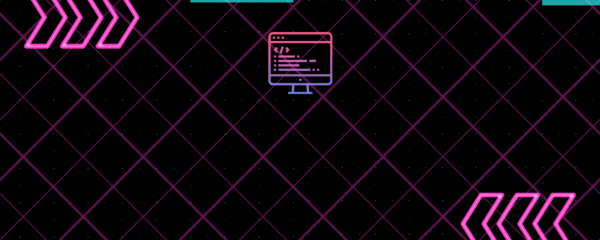

<h3 align="center">👨‍💻CSE student from IIT BHU 🖥️</h2>

## 🤵‍♂️ About Me
I am currently pursuing IDD course at Computer Science and Engineering from the Indian Institute of Technology (BHU), Varanasi.

- 💻 My current focus lies in learning Competitive Programming and DSA.
- 💡 I'm passionate about new technologies and solving real world problems.
- ✨ I’m constantly working on interesting projects.
- 📧 You can connect with me at sudhanshu.ranjan.cd.cse21@iitbhu.ac.in

## 📊 GitHub Stats

  
  

